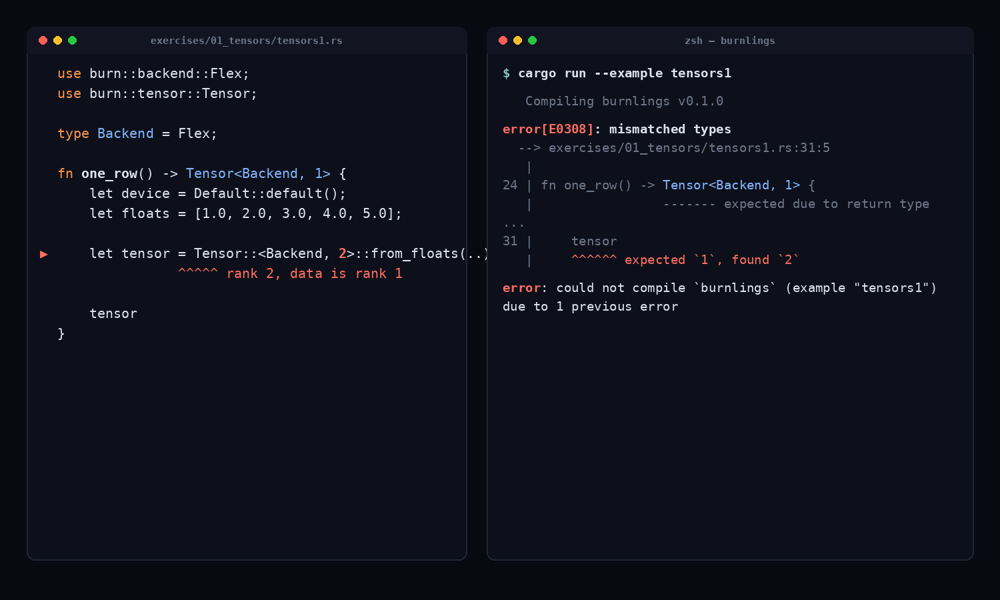

# Burnlings 🔥🦀

Small exercises to get you used to reading and writing deep-learning code in
Rust with the [Burn](https://github.com/tracel-ai/burn) framework — in the
spirit of [Rustlings](https://github.com/rust-lang/rustlings).

Each exercise is a single file with a compiler or logic error. Your job is to
fix it. The exercises track the chapters of the *Learning Burn* book, so you can
read a chapter and then drill the idea until it compiles.

## See it in action

<p align="center">
  
</p>

This is `tensors1`, unedited. The exercise's tensor has 5 numbers in a single
row — shape `[5]`, rank 1 — but the code asks for rank 2. Real Rust does not
let that slide: `cargo run` fails before a single number ever prints, with a
compiler error pointing at the exact line and telling you what it expected.
Change one digit, and `cargo run` prints the tensor and `cargo test` goes
green. That's the whole idea of Burnlings: shape mistakes that would blow up
mid-training in a dynamically-typed framework show up here as a compile
error, on your first `cargo run`, before you've wasted a GPU-hour finding out
the hard way.

## How it works

Every exercise starts with an `// I AM NOT DONE` comment and a `// TODO`
describing what to fix. Fix the code, remove the `I AM NOT DONE` line, and move
on. Metadata (order, hints, whether an exercise is checked by a test) lives in
[`info.toml`](info.toml), the same format Rustlings uses.

```
burnlings/
├── Cargo.toml            # burn 0.21.0, flex (CPU) + autodiff backend
├── info.toml             # exercise list + hints (Rustlings format)
├── exercises/
│   └── 01_tensors/
│       ├── tensors1.rs … tensors9.rs   # <- the exercises you solve
│       └── README.md                   # <- exercise-to-book map for the chapter
└── solutions/
    └── 01_tensors/
        └── tensors1.rs … tensors9.rs   # <- reference (peek only if stuck)
```

## Backend

Exercises run on [`burn-flex`](https://crates.io/crates/burn-flex), Burn's
pure-Rust CPU backend (`features = ["flex", "autodiff"]`). Flex is what Burn
recommends for new projects — `burn-ndarray` is kept for compatibility but is
marked *legacy — prefer flex* in Burn's own docs. Flex needs no BLAS or C
toolchain, so `cargo test --example ...` works the same on Linux, macOS and
Windows.

Nothing in the exercises is Flex-specific: every file declares its backend in
one place (`type Backend = Flex;`), so you can point them at another backend —
`Wgpu`, `Cuda`, `NdArray` — by changing that line and the Cargo feature. Note
that a backend picks its own default int element type (Flex uses `i32`,
NdArray `i64`), so read integer tensor data with `TensorData::iter::<T>()`,
which converts, rather than `as_slice::<T>()`, which requires an exact match.

## Running an exercise

Every exercise is registered as a Cargo example, so you run and check one by
name:

```bash
cargo run  --example tensors1     # runs it (fails until you fix it)
cargo test --example tensors1     # checks it with the built-in test
```

When you're stuck, read the `hint` for that exercise in `info.toml`, or open the
matching file under `solutions/`.

## Chapters

Fourteen chapters, **53 exercises**, tracking the *Learning Burn* book one
concept at a time. Each chapter folder has its own `README.md` with the full
exercise-to-book map.

| # | Chapter | Exercises | What you drill |
|---|---|---|---|
| 1 | `01_tensors` | `tensors1…9` (9) | rank vs shape, creation, int tensors, filled & random tensors, building from a struct, the data bridge, ownership/cloning, float closeness |
| 2 | `02_ops` | `ops1…6` (6) | element-wise arithmetic, broadcasting (`unsqueeze`), reshape & slice, reductions, feature standardisation, boolean masking |
| 3 | `03_matmul` | `matmul1…3` (3) | the shape rule `[m,k]@[k,n]->[m,n]`, matmul vs element-wise, `linalg::matvec`, batched matmul |
| 4 | `04_norms` | `norms1`, `norms2`, `gram1` (3) | `l2_norm`, `vector_normalize`, and the Gram matrix |
| 5 | `05_autodiff` | `grad1…3` (3) | `require_grad` / `backward` / `grad`, the autodiff backend |
| 6 | `06_gradient_descent` | `gd1`, `gd2` (2) | manual gradient descent, then the same MSE gradient via autodiff |
| 7 | `07_activations` | `act1…3` (3) | the ReLU family, sigmoid & tanh, softmax over the right axis |
| 8 | `08_losses` | `mse1`, `ce1`, `huber1`, `bce1`, `kldiv1`, `cosine1` (6) | MSE, cross-entropy, Huber, binary cross-entropy, KL divergence, cosine embedding |
| 9 | `09_training` | `sgd1`, `opt1` (2) | the four-beat training loop, and swapping optimizers |
| 10 | `10_backprop` | `bp1`, `bp2`, `xor1` (3) | the chain rule by hand, backprop through a hidden layer, learning XOR |
| 11 | `11_from_scratch` | `net1`, `net2`, `net3` (3) | a layer is a matmul, hand vs autodiff gradients, manual SGD |
| 12 | `12_attention` | `attn1…4` (4) | scaled dot-product attention, causal masking, multi-head attention, a transformer block |
| 13 | `13_saving` | `save1`, `prec1` (2) | train → save → reload → predict, and recorder precision (f32 vs f16) |
| 14 | `14_deploy` | `bytes1`, `generic1`, `quant1`, `count1` (4) | weights in RAM as bytes, backend-generic inference, int8 quantization, model footprint |

Work through them in order — each chapter assumes the one before. Some exercises
are compile errors, others are logic errors caught by a test; a few are the
"compiles fine but silently wrong" traps the book warns about.

## Relationship to Learning Burn

Exercises mirror the runnable examples in the
[Learning Burn](https://github.com/jhosein58/learning-burn) book. For example,
chapter 1's `tensors1` corresponds to the book's `rank_vs_shape` example: rank
is part of a Burn tensor's type. Each chapter's `README.md` lists the full
exercise-to-example mapping.

## Credit

Burn is built by the [Tracel AI team](https://github.com/tracel-ai/burn).
This repo is exercise code against Burn's public API, patterned after Rustlings.
